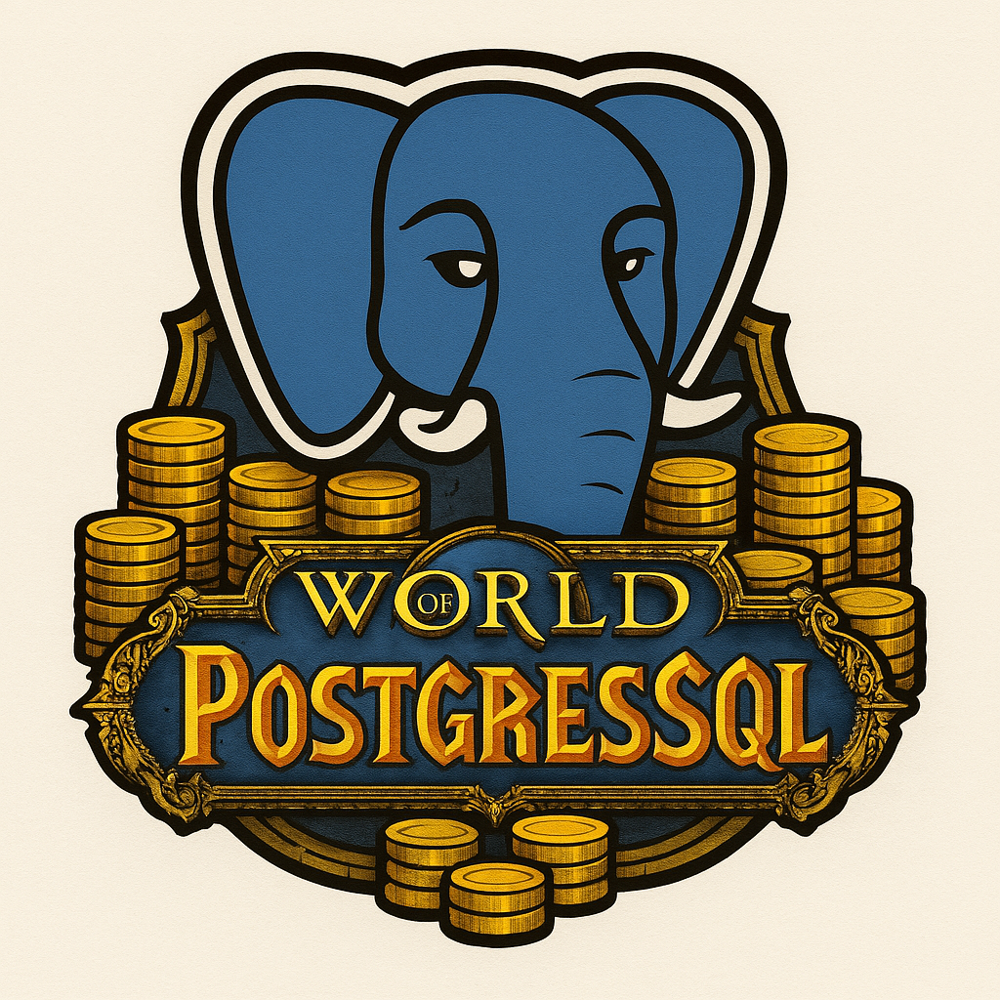

# 

> Full stack application for tracking the World Of Warcraft auction house, all implemented in Postgres

## 🚩 Table of Contents
- [Why?](#-but-why)
- [Features](#-features)
- [Getting started](#-getting-started)

## 🙋 But why?
This project is primarily setup as a creative challenge, and an attempt to answer the question: Just how far can you take Postgres?.
The goal is to not just use postgres as the database, but as the data ingestion layer, auth layer and even the frontend.

## 🎨 Features

## Getting started
### Dependencies
This project uses [Flyway](https://www.red-gate.com/products/flyway) to handle database migrations, functions etc.

### Run via Docker
To run the project simply use:
```bash
docker compose up
```

### Pre-requisites if running outside of Docker
Make sure that your postgres instance is up to date (we're running version 17), and that you have the following
dependencies installed on the host machine:
* [pgTap](https://pgtap.org/): Used for unit testing


